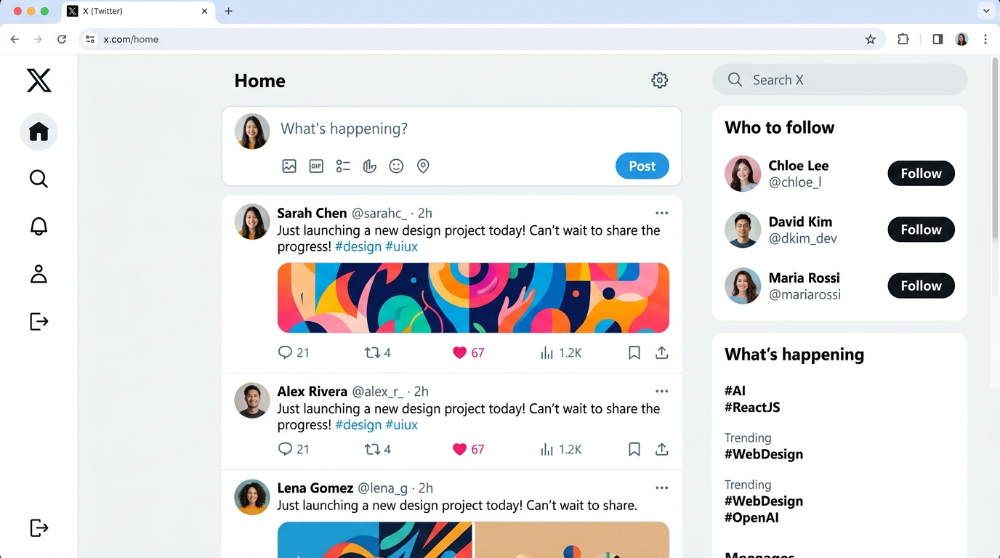
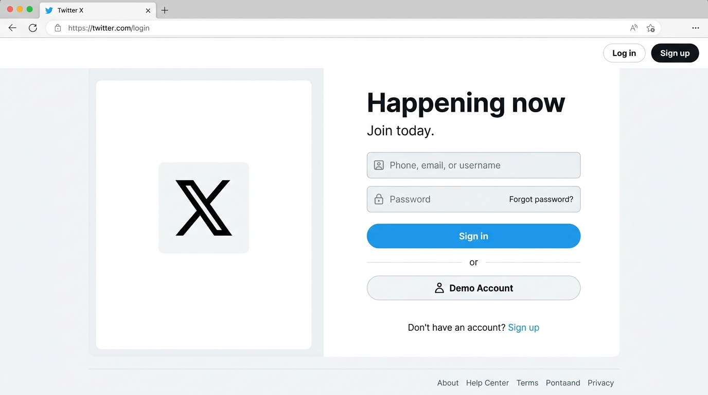
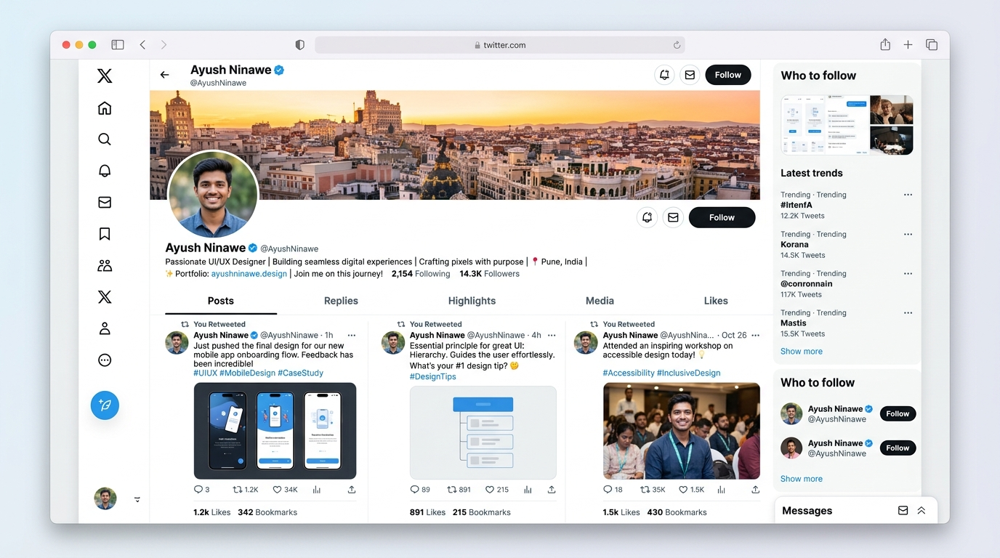

# 🐦 Twitter (X) Clone - Full Stack MERN Application

A modern, full-featured Twitter (X) clone built with a unified full-stack architecture combining a React SPA frontend with an Express / Node.js backend.

---

## 📸 Screenshots & Previews

### 1. Home Feed & Dashboard
The main feed showing the tweet composer, tabbed navigation (*For You* & *Following*), real-time like interactions, and recommendation sidebar.



### 2. Login & Authentication Page
Clean landing and authentication interface supporting sign-in, account creation, and one-click demo login.



### 3. User Profile & Timeline
User profile page displaying profile banner, avatar, follower/following stats, bio, and personalized tweet timeline.



---

## 📖 About The Project

This project replicates the core features and design of Twitter (X), providing an interactive, responsive microblogging experience. It is engineered with a unified architecture where Express handles RESTful API endpoints and statically serves the production-bundled React frontend on port `3000`.

### Key Features

- **Authentication & Security**:
  - Secure registration and login with bcrypt password hashing and JSON Web Tokens (JWT).
  - Quick-start "Use Demo Account" for instant exploration without manual signup.
  - Resilient safe-storage adapter supporting sandboxed browser iframes and local environments.
- **Microblogging & Feeds**:
  - Tweet composer with character count and responsive posting.
  - Tabbed feeds: **For You** (all community tweets) and **Following** (personalized feed of users you follow).
  - Relative timestamping (e.g. `2m`, `1h`, `3d`).
- **Interactions**:
  - Real-time like & unlike counters on tweets.
  - Tweet deletion for post authors.
  - Bookmarking capability.
- **User Profiles & Relationships**:
  - User profile view showing bio, join status, follower/following counts, and avatar banners.
  - Dynamic follow / unfollow relationships with mutual updates.
  - "Who to follow" suggestion sidebar with direct profile navigation.
- **Resilient Data Architecture**:
  - Connects to MongoDB with Mongoose schemas.
  - Automatically falls back to an in-memory database store with seed data if MongoDB is not connected, ensuring zero downtime in sandboxed preview environments.

---

## 🛠️ Technology Stack

| Layer | Technologies |
|---|---|
| **Frontend** | React 19, Redux Toolkit, Redux Persist, React Router DOM v7, Tailwind CSS, React Icons, React Hot Toast |
| **Backend** | Node.js, Express 4, Cookie Parser, CORS, JSON Web Token (JWT), BcryptJS |
| **Database** | MongoDB / Mongoose (with automated in-memory store fallback) |
| **Build Tooling** | Vite 8, Rolldown |

---

## 🚀 Getting Started

### Prerequisites
- Node.js (v18 or higher recommended)
- npm or bun

### Installation & Run

1. **Install dependencies**:
   ```bash
   npm install
   ```

2. **Configure Environment Variables** (Optional, creates demo fallback defaults if omitted):
   ```env
   PORT=3000
   MONGO_URI=mongodb+srv://<user>:<password>@cluster.mongodb.net/twitter
   TOKEN_SECRET=your_jwt_secret_key
   ```

3. **Build and start the application**:
   ```bash
   npm run dev
   ```
   Or to run the compiled production server:
   ```bash
   npm run build
   npm start
   ```

4. **Access the application**:
   Navigate to `http://localhost:3000` in your browser.

---

## 👥 Demo Credentials

For quick evaluation, click **"Use Demo Account"** on the sign-in screen or use:
- **Email:** `demo@example.com`
- **Password:** `password123`
